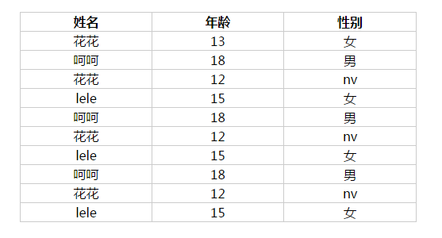

##jQuery.js(Ajax)的使用
####今天咱们讲一下使用ajax获取外部数据，直接渲染到html页面当中。
####参数
    url,[settings]一个用来包含发送请求的URL字符串。
    settings:AJAX 请求设置。所有选项都是可选的。

####settings:选项
    accepts默认： 取决于数据类型。

    内容类型发送请求头，告诉服务器什么样的响应会接受返回。如果accepts设置需要修改，推荐在$.ajaxSetup()方法中做一次。

####contents
	一个以"{字符串:正则表达式}"配对的对象，用来确定jQuery将如何解析响应，给定其内容类型。

####1.首先要到官网下载jQueruy，如图：

####下载最新版本：jQuery3.1.1版本

#####2.开始安装吧，安装完成后把jQuery文件放到怎么的js目录下，现在开始写代码了，今天要弄的是一个获取学生信息的数据的表格，下图是HTML的代码：
     <table class="xinxi">
        <tr>
          <th>姓名</th>
          <th>年龄</th>
          <th>性别</th>
        </tr>
        <tr>
          <td>花花</td>
          <td>13</td>
          <td>女</td>
        </tr>
      </table>
#####3.这是css部分的代码;

    .xinxi{
          margin: 50px auto;
          border-collapse: collapse;
          width: 500px;
        }
        .xinxi td,th{
          border: 1px solid #ccc;
          text-align: center;
        }
######到这我们会看到我们的页面已经有效果了：

#####4.现在我们开始js部分也是实现我们的ajax外部获取的重要部分，在之前我们先要弄一个外部存储数据的文件格式如下：
    [
      {"nenm":"呵呵","age":18,"sex":"男" },
      {"nenm":"花花","age":12,"sex":"nv" },
      {"nenm":"lele","age":15,"sex":"女" },
      {"nenm":"呵呵","age":18,"sex":"男" },
      {"nenm":"花花","age":12,"sex":"nv" },
      {"nenm":"lele","age":15,"sex":"女" },
      {"nenm":"呵呵","age":18,"sex":"男" },
      {"nenm":"花花","age":12,"sex":"nv" },
      {"nenm":"lele","age":15,"sex":"女" }
    ]
#####5.这就js的代码
    $.ajax({
      url: "http://192.168.64.69:8000/student.json",
      success: function(data){
        var datas=data;
        for (var i = 0, l = datas.length;i<l;i++) {
        var dat=datas[i];
        var trstr="<tr><td>"+dat.nenm+"</td><td>"+dat.age+"</td><td>"+dat.sex+"</td></tr>";
        $(".xinxi").append(trstr);
        }
      }
    });
######到这里咱们想要的页面效果已经出来了：

